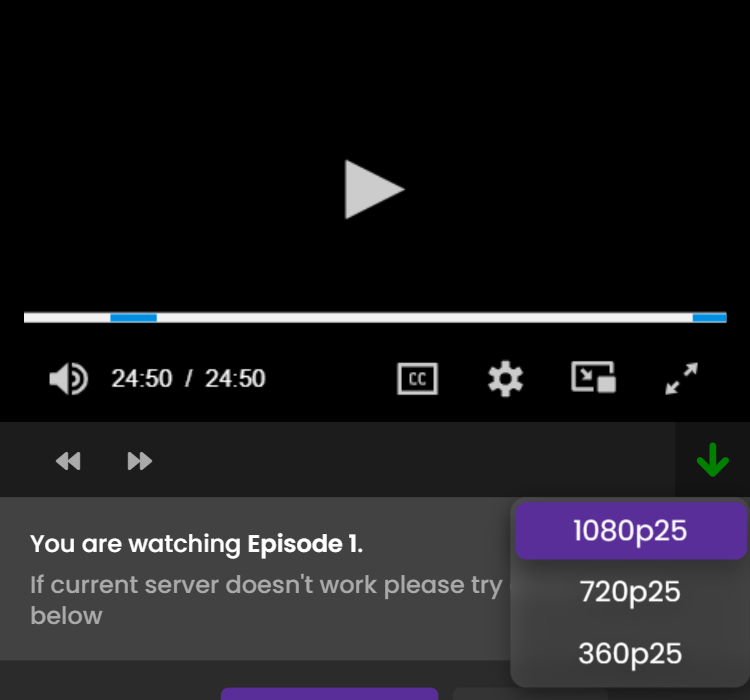

<h1 align="center">9anime Downloader</h1>
<p align="right">
    
    <a href="#donate">💲Support the Project</a>
</p>
<p align="center">
    
</p>

## How to Install:
### Chrome:
  1. Download latest **[Release](https://github.com/SuperZombi/9anime-downloader/releases)**.
  2. Unpack the ```src``` folder to a convenient location.
  3. ```⋮``` > "Additional tools" > "Extensions".
  4. Turn on "Developer Mode".
  5. Press "Load unpacked extension".
  6. Select the path to the ```src``` folder.


## How to Use:
  1. The plugin gives a stream in `m3u8` format.
  2. Copy the stream link or download it.
  3. Download it using [this program](https://github.com/SuperZombi/.m3u8).

<hr>

#### 💲Donate

<table>
  <tr>
    <td>
       
    </td>
    <td>
      <a href="https://donatello.to/super_zombi">Donatello</a>
    </td>
  </tr>
  <tr>
    <td>
       
    </td>
    <td>
      <a href="https://www.donationalerts.com/r/super_zombi">Donation Alerts</a>
    </td>
  </tr>
</table>
    
(But now it's better to email me and I'll send you the details)
